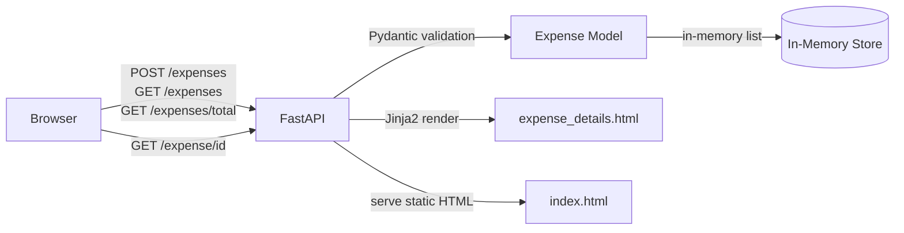

# Expense Tracker

A lightweight REST API and browser UI for tracking personal expenses, built with FastAPI, Pydantic, and Jinja2. Deployable to Google Cloud Run via Docker.

  

---

## Overview

Expense Tracker is a full-stack web application that lets users add, view, and summarize personal expenses through a browser-based UI backed by a FastAPI server. Expenses are modeled with strict types via Pydantic and rendered server-side and client-side using Jinja2 templates and vanilla JavaScript. The project is containerized and ready for one-command deployment to Google Cloud Run.

---

## Highlights

- **Typed data model** — `Expense` is a Pydantic `BaseModel` with validated fields: `id`, `amount` (float), `category` (str), `date` (date), and `description` (str), ensuring clean data at the API boundary
- **Two-page browser UI** — an index page for adding expenses, viewing totals, and listing all entries, plus a detail page for individual expense drill-down
- **REST + HTML in one server** — FastAPI serves both JSON API endpoints and Jinja2-rendered HTML from the same process, keeping the stack minimal
- **Cloud Run ready** — the included `Dockerfile` packages Python 3.11 + uvicorn and exposes port 8080, matching Cloud Run's expected interface; deploy with a single `gcloud` command
- **Auto-reload dev server** — `devserver.sh` activates a virtualenv and starts uvicorn with `--reload`, so changes are reflected on the next browser refresh without restarting manually

---

## Features

**Expense Management**
- Add expenses with amount, category, date, and description
- View all expenses in a list with clickable links to detail pages
- Calculate and display total expenses on demand

**API**
- `POST /expenses` — create a new expense
- `GET /expenses` — retrieve all expenses
- `GET /expenses/total` — return the summed total
- `GET /expense/{id}` — retrieve a single expense by ID
- `GET /` — serve the main UI

**Infrastructure**
- Docker image built on `python:3.11.3`
- `PORT` environment variable respected at runtime
- Google Cloud Run deployment via `gcloud run deploy --source .`

---

## Tech Stack

| Layer | Technology | Purpose |
|---|---|---|
| API framework | FastAPI 0.105 | Route handling, request validation, response serialization |
| Data validation | Pydantic 2.5 | Expense model schema and type enforcement |
| Templating | Jinja2 3.1 | Server-side HTML rendering for the detail page |
| ASGI server | Uvicorn 0.24 | Production and development HTTP server |
| Frontend | Vanilla JavaScript | Async fetch calls for adding/listing expenses |
| Containerization | Docker (Python 3.11) | Reproducible builds and Cloud Run deployment |
| Deployment target | Google Cloud Run | Serverless container hosting |

---

## Architecture



---

## How It Works

1. **Server starts** — `main.py` initializes a FastAPI app and uvicorn serves it on port 8080 (or `$PORT`).
2. **UI loads** — navigating to `/` returns `index.html`, which on `window.onload` fetches `GET /expenses` and renders the current expense list.
3. **Adding an expense** — the user fills in amount, category, date, and description. The frontend calls `POST /expenses` with a JSON body; FastAPI validates the payload against the `Expense` Pydantic model before storing it.
4. **Viewing totals** — clicking "Get Total" calls `GET /expenses/total`, which sums all stored amounts and returns `{ "total_expenses": <float> }`.
5. **Drill-down** — each expense in the list is a link to `/expense/{id}`. FastAPI retrieves the matching record and renders `expense_details.html` via Jinja2, injecting the expense fields.

---

## Setup

**Prerequisites:** Python 3.11+, pip

```bash
# 1. Create and activate a virtual environment
python -m venv .venv
source .venv/bin/activate        # macOS/Linux
.venv\Scripts\activate           # Windows

# 2. Install dependencies
pip install -r requirements.txt

# 3. Run the development server (auto-reload)
PORT=9002 bash devserver.sh

# Or run directly
uvicorn main:app --reload --port 9002
```

**Docker**

```bash
docker build -t expense-tracker .
docker run -p 8080:8080 expense-tracker
```

**Deploy to Google Cloud Run**

```bash
gcloud run deploy --source .
```

---

## Usage

Once running, open `http://localhost:9002` (or `http://localhost:8080` for Docker).

**Add an expense via the UI**
- Fill in Amount, Category, Date, and Description
- Click "Add Expense" — the list refreshes automatically

**API examples**

```bash
# Create an expense
curl -X POST http://localhost:9002/expenses \
  -H "Content-Type: application/json" \
  -d '{"id": 1, "amount": 42.50, "category": "Food", "date": "2024-01-15", "description": "Grocery run"}'

# List all expenses
curl http://localhost:9002/expenses

# Get total
curl http://localhost:9002/expenses/total
# → {"total_expenses": 42.50}

# Get a single expense
curl http://localhost:9002/expense/1
```

---

## Key Decisions

| Decision | Rationale | Tradeoff |
|---|---|---|
| Pydantic v2 for the `Expense` model | Enforces field types and date parsing at the API boundary with zero boilerplate | Pydantic v2 has breaking changes from v1; dependency on its specific serialization behavior |
| In-memory storage | Keeps the project dependency-free and deployable without a database | Data is lost on server restart; not suitable for production without adding persistence |
| FastAPI serving both API and HTML | Single process handles JSON consumers and browser navigation, reducing infrastructure | Couples API versioning to UI concerns; a dedicated frontend would scale more cleanly |
| Docker + Cloud Run deployment | Serverless containers require no VM management and scale to zero | Cold starts on Cloud Run can introduce latency after idle periods |

---

## Innovation / Notable Work

- The `Expense` Pydantic model uses Python's `datetime.date` type for the `date` field, which means FastAPI automatically validates and deserializes ISO 8601 date strings — invalid dates are rejected before reaching any handler logic.
- The UI generates a client-side timestamp (`Date.now()`) as the expense `id` on creation, making the frontend responsible for ID generation without a database sequence. This is a deliberate simplification that also surfaces a clear extension point for adding a real persistence layer.
- The `Dockerfile` intentionally keeps the image minimal: it only copies `main.py` (not the full project root), which keeps the production image lean. The `models/` directory would need to be added for full functionality — an intentional scaffold artifact.

---

## About

This project demonstrates building a typed REST API with a minimal browser frontend using the Python FastAPI ecosystem. It covers the core FastAPI patterns — Pydantic models, Jinja2 templating, and async route handlers — alongside containerized deployment to a serverless platform, making it a complete end-to-end reference for Python web API development.
